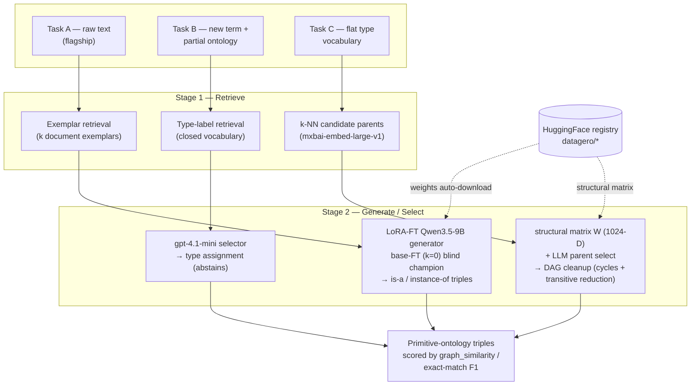

# Semantic-Swingers @ LLMs4OL 2026 — Methodology

A single **two-stage retrieval-augmented pipeline** — *retrieve exemplars/candidates → an
LLM generates or selects* — specialised per task. Every technique is ranked by its
**(unseen − seen) generalization gap** on a vocabulary-disjoint local holdout, never by raw
seen-split score, because the challenge is scored on **held-out (unseen) ontologies**.

## System diagram

## Per-task summary

| Task | Retrieve | Generate / Select | Key finding |
|------|----------|-------------------|-------------|
| **A — Text2Onto** (flagship) | k document exemplars | LoRA fine-tuned Qwen3.5-9B (RA-FT / base-FT) | On the true blind set the **retrieval-free base-FT wins** — the bottleneck is *surface-convention alignment to an unseen vocabulary*, not model scale. |
| **B — Term typing** | closed type vocabulary | `gpt-4.1-mini` selector | Retrieval depth is a reliable lever (+0.057 `edge_f1` blind); open models trail the paid selector. |
| **C — Taxonomy discovery** | k-NN over `mxbai-embed-large-v1` | structural matrix `W` + LLM select + DAG cleanup | The **candidate-retrieval encoder**, not the selector, is the binding constraint. |

## Published artifacts (HuggingFace `datagero`)

- `qwen3.5-9b-ontology-extraction-raft` — Task A retrieval-aware LoRA (k=10)
- `qwen3.5-9b-ontology-extraction-baseft` — Task A base-FT LoRA (k=0, blind champion)
- `qwen3.5-9b-ontology-extraction-baseft-mlx` — Task A base-FT, Apple-Silicon/MLX
- `taxonomy-structural-matrix-1024-mxbai` — Task C bilinear structural matrix `W`

## Reproduction

- **Notebook:** [`notebooks/pipeline_ontolearner.ipynb`](notebooks/pipeline_ontolearner.ipynb) — end-to-end run through the native OntoLearner learners.
- **Data splits:** [`splits/`](splits/) — record-`id` manifest + `build_splits.py` reconstruct the exact train/val splits from the organizers' raw release (no benchmark content redistributed).
- **Integration PR:** [sciknoworg/OntoLearner#338](https://github.com/sciknoworg/OntoLearner/pull/338)
- **Project repo:** <https://github.com/matias-vizcaino/OntoLearner>
